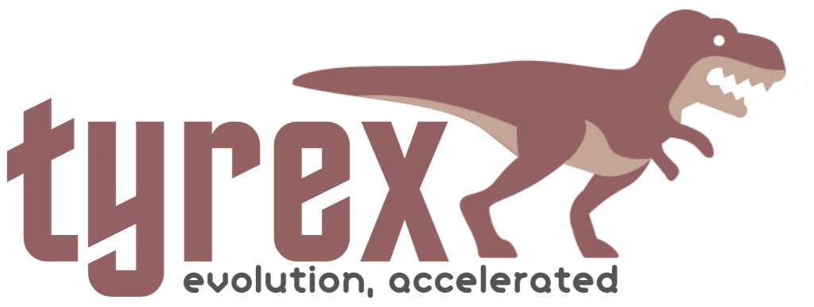

<p align="left"></p>

---

A comprehensive genetic programming and neuroevolution library for Elixir. Tyrex provides implementations of standard genetic algorithms as well as the NEAT (NeuroEvolution of Augmenting Topologies) algorithm, allowing you to evolve solutions to a wide variety of problems.

## Features

- **Standard Genetic Algorithms**: Complete implementations with various selection, crossover, and mutation strategies
- **NEAT Algorithm**: Full implementation of the NEAT algorithm for evolving neural networks
- **Parallelized Evaluation**: Efficient fitness evaluation using Elixir's concurrency
- **Distributed Computing**: Optional distributed computation across multiple nodes
- **Checkpoint System**: Save and resume evolution runs
- **Statistics Tracking**: Comprehensive statistics and visualization options
- **Extensible Design**: Easy to add new genotypes, selection methods, and more

## Installation

Add Tyrex to your list of dependencies in `mix.exs`:

```elixir
def deps do
  [
    {:genetic_ex, "~> 0.1.0"}
  ]
end
```

## Basic Usage

### Standard Genetic Algorithm

```elixir
# Define a problem
problem = %Tyrex.Problem{
  name: "String Match",
  genotype: Tyrex.Genotypes.String,
  genotype_params: [length: 11],
  fitness_function: &string_match_fitness/1,
  termination: &max_fitness_termination/2
}

# Run the algorithm
{best, stats} = Tyrex.run(problem,
  population_size: 100,
  max_generations: 100,
  selection_strategy: {Tyrex.Selection.Tournament, tournament_size: 3},
  crossover_rate: 0.7,
  mutation_rate: 0.05
)

# Display results
IO.puts("Best solution: #{Tyrex.Genotypes.String.to_string(best)}")
IO.puts("Fitness: #{best.fitness}")
IO.puts("Generations: #{stats.generations}")
```

### NEAT Algorithm

```elixir
# Define a NEAT problem
problem = %Tyrex.Problem{
  name: "XOR Problem",
  fitness_function: &xor_fitness_function/2,  # Takes (genome, network) as arguments
  termination: &termination_function/2
}

# Run NEAT
{best_genome, stats} = Tyrex.NEAT.run(problem,
  population_size: 150,
  max_generations: 300,
  compatibility_threshold: 3.0,
  inputs: 2,  # Number of input nodes
  outputs: 1  # Number of output nodes
)

# Create a network from the best genome
network = Tyrex.NEAT.Network.create(best_genome)

# Test the network
IO.puts("XOR Results:")
IO.puts("0 XOR 0 = #{hd(Tyrex.NEAT.Network.activate(network, [0.0, 0.0]))}")
IO.puts("0 XOR 1 = #{hd(Tyrex.NEAT.Network.activate(network, [0.0, 1.0]))}")
IO.puts("1 XOR 0 = #{hd(Tyrex.NEAT.Network.activate(network, [1.0, 0.0]))}")
IO.puts("1 XOR 1 = #{hd(Tyrex.NEAT.Network.activate(network, [1.0, 1.0]))}")
```

## Examples

Tyrex comes with several example problems to help you get started:

- **String Matching**: Evolve a string to match a target string (e.g., "abracadabra")
- **XOR**: Evolve a neural network to solve the XOR problem
- **Image Evolution**: Evolve SVG images to match a target image
- **Function Approximation**: Evolve a mathematical expression to fit a dataset

To run the examples:

```elixir
# Run the string matching example with standard GA
Tyrex.Examples.Abracadabra.run_standard()

# Run the string matching example with NEAT
Tyrex.Examples.Abracadabra.run_neat()
```

## Creating Custom Genotypes

You can easily create custom genotypes for your specific problems:

```elixir
defmodule MyApp.CustomGenotype do
  @moduledoc """
  Custom genotype for solving my specific problem.
  """

  def create(opts \\ []) do
    # Create a new individual with random genes
    %{genes: [...], fitness: 0}
  end

  def crossover(parent1, parent2, opts \\ []) do
    # Implement crossover logic
    [child1, child2]
  end

  def mutate(individual, opts \\ []) do
    # Implement mutation logic
    %{individual | genes: [...]}
  end

  # Add other helper functions
end
```

## Advanced Features

### Asynchronous Evolution

```elixir
# Start an evolution run asynchronously
run_id = Tyrex.run_async(problem, opts)

# Check status
{:ok, status} = Tyrex.status(run_id)

# Stop the run
:ok = Tyrex.stop(run_id)
```

### Checkpointing

```elixir
# Save a checkpoint
Tyrex.CheckpointManager.save_checkpoint(run_id, evolution_state)

# Load a checkpoint
{:ok, state} = Tyrex.CheckpointManager.load_checkpoint(run_id)

# List all checkpoints
checkpoints = Tyrex.CheckpointManager.list_checkpoints()
```

### Distributed Evaluation

```elixir
# Connect nodes
Node.connect(:'node1@host1')
Node.connect(:'node2@host2')

# Run with distributed evaluation
{best, stats} = Tyrex.run(problem,
  parallel: [
    distributed: true,
    chunk_size: 10,
    timeout: 60_000
  ]
)
```

## License

Tyrex is licensed under the MIT License.
